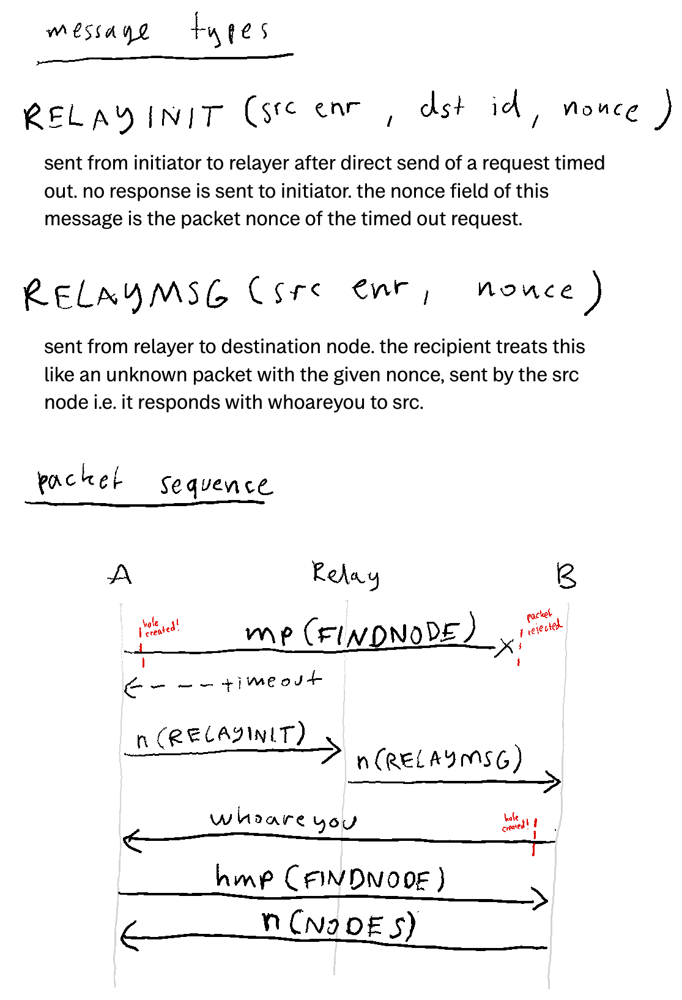

# NAT Hole Punching in Discv5
NAT hole punching in discv5, optimisation of [Rendezvous protocol](https://github.com/ethereum/devp2p/issues/207).

Manual testing: https://github.com/emhane/discv5-cli/blob/nat/README.md

Plugged in to discv5: https://github.com/emhane/discv5/tree/nat-hole-punch

@emhane [@fjl](https://github.com/fjl)
